<div align="center">


# Faro

**A modern desktop client for SFTP, FTP, SSH, S3-compatible, WebDAV, and cloud storage.**

[](https://github.com/jhd3197/faro/releases)
[](LICENSE)
[](https://tauri.app)

*Servers · storage · sessions, all in one workspace.*

**🤖 New — [Agent Bridge](#-agent-bridge): hand a live server to Claude Code (or any MCP agent) — through your authenticated session, with per-command approval, and zero credentials shared.**

</div>

---

## What it is

Faro is what you'd get if you let FileZilla, PuTTY, and a half-dozen cloud-storage browsers share one window and one connection list. Save a server once, open its files in the dual-pane browser and a terminal tab against the same SSH session, drag-and-drop transfers between sides, keep a folder continuously synced, edit remote files in your local editor with auto-upload on save — and run all of the same operations from a CLI when you don't feel like clicking.

One connection list now spans **thirteen backends** — SFTP, FTP/FTPS, S3 (with presets for AWS, R2, B2, Wasabi, and a dozen more), Azure Blob, Google Cloud Storage, WebDAV, read-only HTTP, the Dropbox / OneDrive / Google Drive / Box clouds, and Faro's own paired **[Agent](#-faro-agent--control-another-machine)** — all behind one `RemoteFs` trait, so browse, transfer, sync, and the [disk-usage, diff, and search](#-explore-diff-and-search-any-backend) tools work the same on every one.

And when you want an AI agent to actually *do* something on a box, the **[Agent Bridge](#-agent-bridge)** lets it run commands through the session you already opened — no remote install, no keys handed over, every command gated behind your approval.

<!-- FARO:SHOTS:START -->
## 📸 Screenshots

> Captured from a mock-data build — every hostname, IP, username, and path below is fictional. See [`docs/screenshots/CAPTURE.md`](docs/screenshots/CAPTURE.md) for the shot list and how to reproduce them.

<details open>
<summary><strong>Dual-pane browser</strong> — Local and remote side by side, drag-and-drop transfers between them</summary>

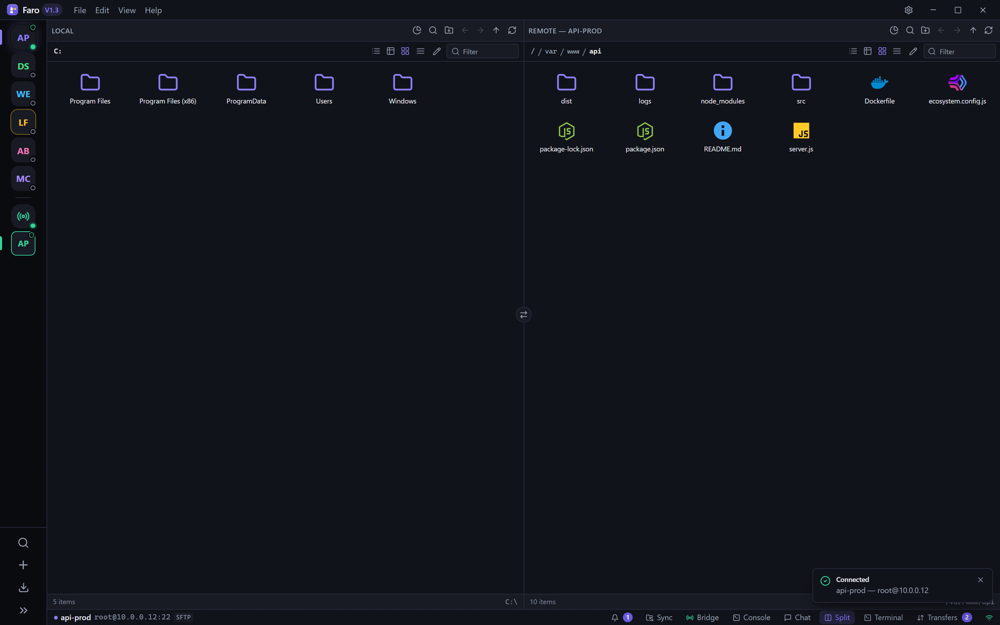

</details>

<details open>
<summary><strong>Disk Usage Explorer</strong> — a WinDirStat-style treemap over <em>any</em> backend, with a size-ranked list and a server-side <code>du</code>/<code>find</code> fast path</summary>

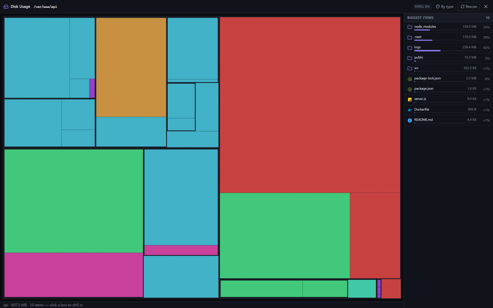

</details>

<details>
<summary><strong>Server rail</strong> — Discord-style connection bubbles, with an expandable labeled mode for spotting servers fast</summary>

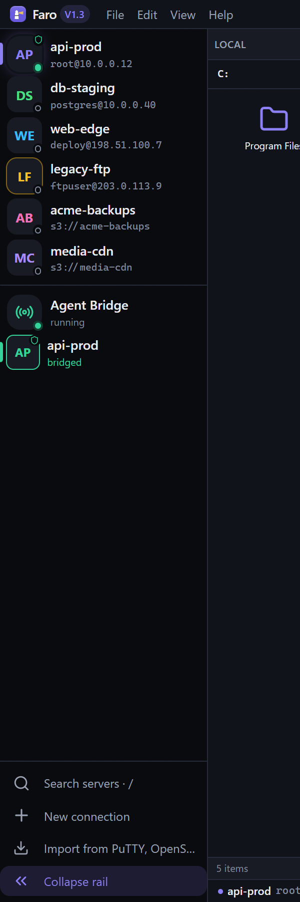

</details>

<details>
<summary><strong>Integrated terminal</strong> — A real SSH shell tab against the same session you're browsing</summary>

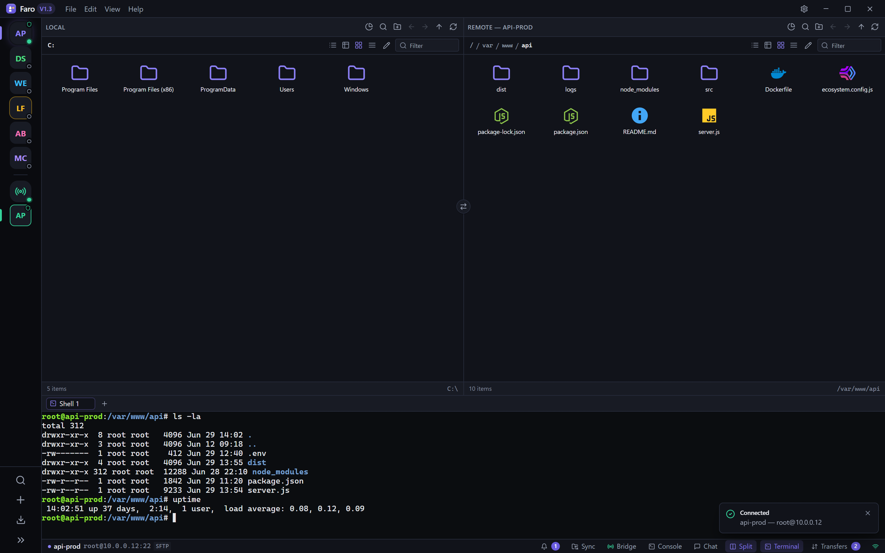

</details>

<details>
<summary><strong>File actions</strong> — Right-click for duplicate, properties, "download folder as .tar.gz/.zip", and "open terminal here"</summary>

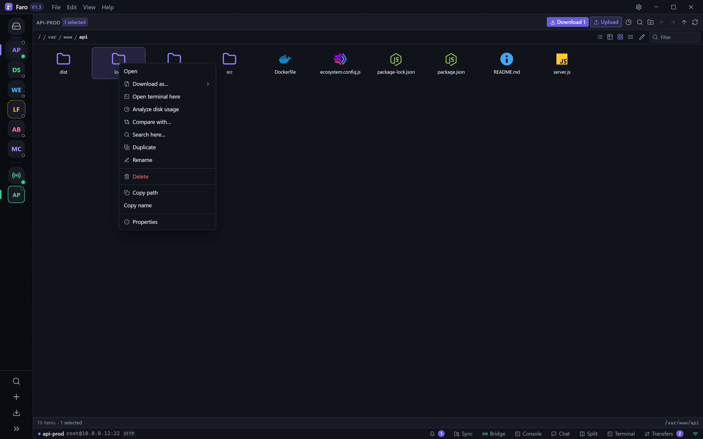

</details>

<details>
<summary><strong>Transfers</strong> — Queued downloads/uploads with progress and FileZilla-style overwrite prompts</summary>

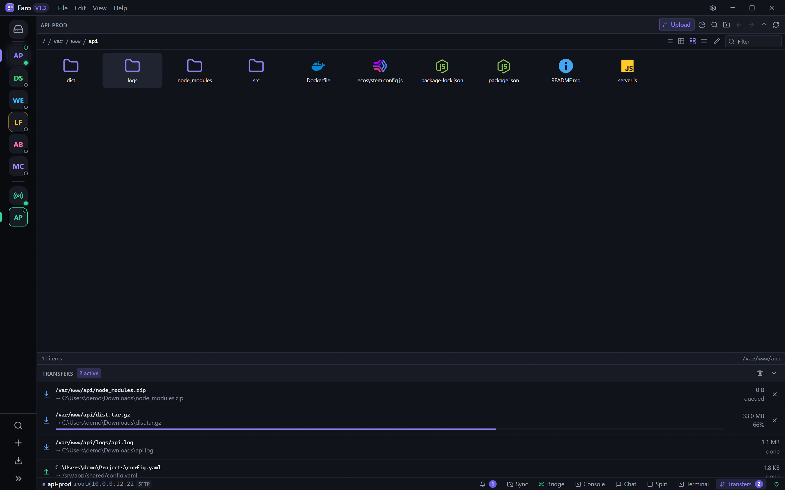

</details>

<details>
<summary><strong>Directory sync</strong> — Preview a one-way sync plan before anything moves</summary>

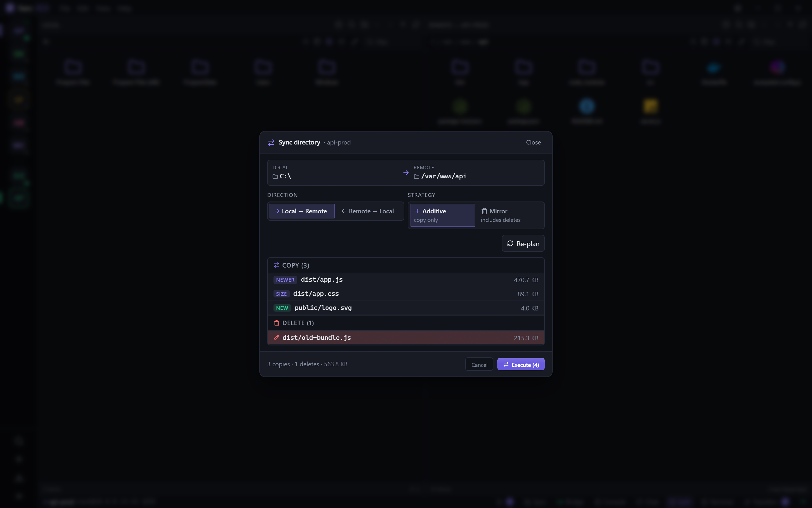

</details>

<details>
<summary><strong>Agent Bridge</strong> — Approve (or auto-approve) each command an AI agent runs on a live session</summary>

The headline feature: lend an AI agent your *already-authenticated* SSH session over a guarded localhost endpoint — no remote install, no keys shared, every command gated behind your approval.

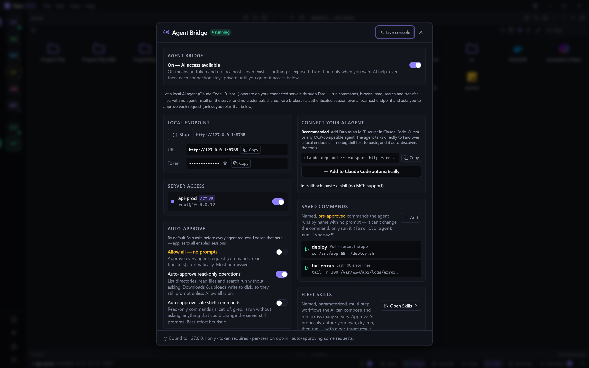

When an agent asks to run something, Faro prompts you with the exact command before anything touches the server:

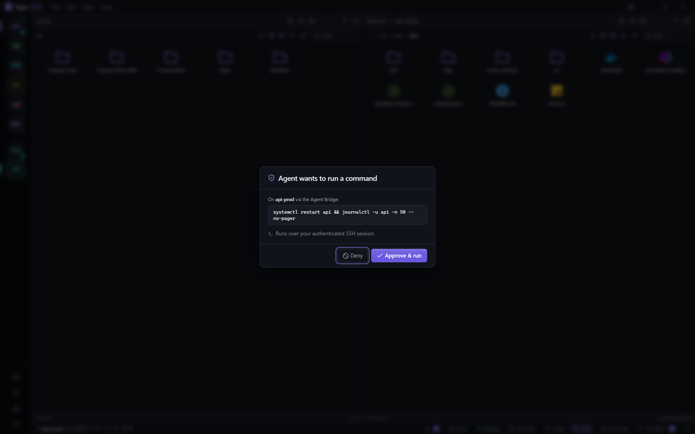

</details>

<details>
<summary><strong>S3 / object storage</strong> — Browse buckets like a filesystem alongside your SFTP and FTP servers</summary>

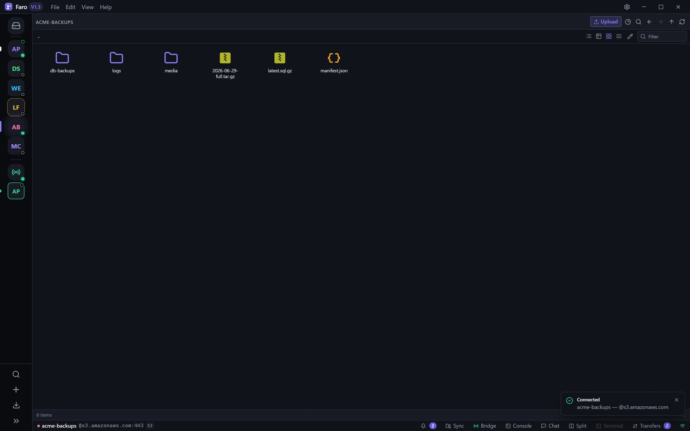

</details>

<details>
<summary><strong>New connection</strong> — One profile editor for all thirteen backends, with the protocol picker grouped in a rail so the list scales</summary>

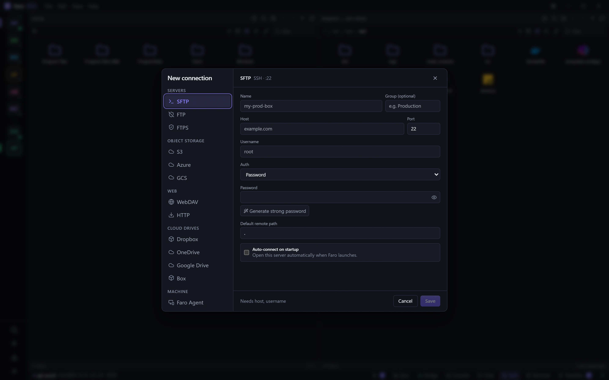

</details>

<details>
<summary><strong>Settings</strong> — Themes, terminal behavior (copy-on-select, scrollback), transfers, and the default editor</summary>

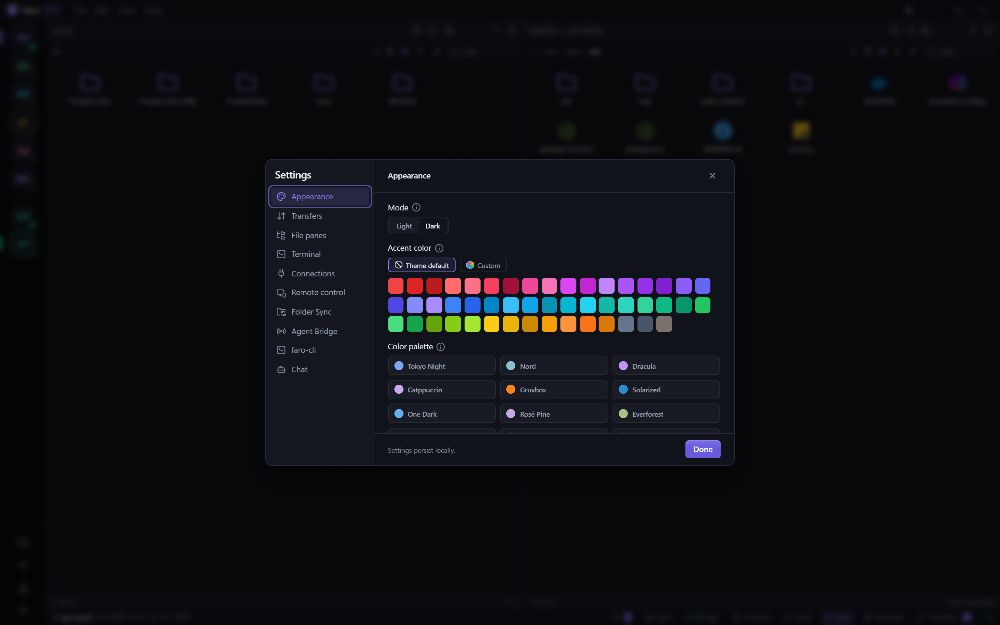

</details>
<!-- FARO:SHOTS:END -->

## Download

Grab the latest installer from the [**Releases**](https://github.com/jhd3197/faro/releases/latest) page — every push to `main` publishes fresh builds for all three desktop platforms plus the standalone `faro-cli`.

| Platform | Installer | First-launch note |
|---|---|---|
| **macOS** (Intel + Apple Silicon) | `.dmg` (universal) | One-time `xattr` step ↓ |
| **Windows** (x64) | `.exe` (NSIS) or `.msi` | SmartScreen → *More info → Run anyway* |
| **Linux** (x64) | `.AppImage`, `.deb`, `.rpm` | `chmod +x` the AppImage |

Builds are **unsigned** (no Apple Developer / Windows EV certificate yet), so each OS guards the first launch:

- **macOS** — after dragging **Faro.app** to **/Applications**, run this once in Terminal, then open the app normally:
  ```bash
  xattr -cr /Applications/Faro.app
  ```
  It's needed because the build isn't notarized by Apple; without it macOS reports the app as "damaged."
- **Windows** — on the *"Windows protected your PC"* prompt, click **More info → Run anyway**.

> Prefer to build from source? See [Develop](#develop) below.

## 🤖 Agent Bridge

**Let a local AI agent run commands on your servers — safely.**

This is the part that makes Faro more than a file client. Connect to a server once, and Faro can lend that **already-authenticated SSH session** to a local AI agent — Claude Code, Cursor, anything that speaks [MCP](https://modelcontextprotocol.io) — so the agent operates on the box **without installing anything remote and without ever seeing your credentials.** Faro stays the gatekeeper.

> **Why it's different:** most "AI over SSH" setups make you hand the agent your keys or stand up a server-side daemon. Faro does neither. The agent borrows the session *you* already opened, *you* approve every command, and nothing reaches the server except the commands you OK.

**Wire it into Claude Code — native MCP, auto-discovered tools:**

1. Connect to a server, open the **Bridge** panel (status-bar pill), hit **Start**, and flip on **Allow agent access**.
2. Copy the one-liner the panel generates and run it in your project:
   ```bash
   claude mcp add --transport http faro http://127.0.0.1:<port>/mcp \
     --header "Authorization: Bearer <token>"
   ```
3. Claude Code now has two tools — `faro_list_sessions` and `faro_exec`. Ask it *"check disk usage on the server"* and it runs through Faro. (Prefer curl or another agent? The panel also exports a ready-to-paste `SKILL.md` for the plain HTTP API.)

**The guardrails — all on by default:**

- 🔒 **Localhost only** — bound to `127.0.0.1` on a random port.
- 🔑 **Bearer token** — per-launch, required on every request.
- ☑️ **Per-session opt-in** — no connection is reachable until you turn it on.
- 🙋 **Approve every command** — each `exec` pops a prompt in Faro and blocks until you click Approve (or it times out).
- 📋 **Live audit log** — every command, approval, and denial, right in the panel.

Surface: `GET /health`, `GET /sessions`, `POST /exec`, and `POST /mcp` (MCP Streamable HTTP). It's a hand-rolled localhost server on the existing tokio runtime — **zero new dependencies.**

## Backends

Every backend is one `RemoteFs` implementation, so the dual-pane browser, the
transfer queue, sync, disk-usage explorer, diff, and search all pick it up for
free. Capability differences (no shell on a bucket, read-only on HTTP) hide the
affordances they don't support rather than reinventing them.

| Backend | Browse | Transfer | Sync | Shell |
|---|:-:|:-:|:-:|:-:|
| **SFTP** (SSH) | ✓ | ✓ | ✓ | ✓ |
| **FTP** | ✓ | ✓ | ✓ | — |
| **FTPS** (explicit) | ✓ | ✓ | ✓ | — |
| **S3-compatible** (AWS, R2, B2, Wasabi, …) | ✓ | ✓ | ✓ | — |
| **Azure Blob** | ✓ | ✓ | ✓ | — |
| **Google Cloud Storage** | ✓ | ✓ | ✓ | — |
| **WebDAV** (Nextcloud, ownCloud, …) | ✓ | ✓ | ✓ | — |
| **HTTP(S)** (autoindex / direct URL) | ✓ | download | ← only | — |
| **Dropbox** | ✓ | ✓ | ✓ | — |
| **OneDrive** | ✓ | ✓ | ✓ | — |
| **Google Drive** | ✓ | ✓ | ✓ | — |
| **Box** | ✓ | ✓ | ✓ | — |
| **Faro Agent** | ✓ | ✓ | ✓ | exec |

**S3 presets** — pick a vendor and the endpoint/region template fills in: Amazon
S3, Cloudflare R2, Backblaze B2, Wasabi, DigitalOcean Spaces, MinIO, Storj,
Hetzner, Scaleway, Oracle OCI, IBM COS, Supabase, and a generic self-hosted
option (Ceph RGW, Garage, SeaweedFS, …). Every non-AWS endpoint is treated the
same under the hood — path-style addressing, access-key/secret credentials.

**Cloud drives** authorize once through your browser (loopback + PKCE OAuth);
Faro stores only the refresh token in your OS keychain and never sees your
password. **HTTP(S)** is a read-only source — point it at an nginx/Apache
autoindex to browse, or a direct URL to pull one artifact; uploads, renames, and
deletes are refused.

## 🖥️ Faro Agent — control another machine

Reach a whole computer — Windows, macOS, or Linux — the way you already drive a
remote server, but **without setting up an SSH server** on it. Pair it once with
a 6-digit code (RustDesk-style) and it appears in Faro as a connection you can
browse, transfer files through, and run native commands on. And because the
[Agent Bridge](#-agent-bridge) brokers Faro's sessions to a local AI, this lets
Claude Code run **PowerShell on your Windows box or `sh` on your Mac, from
anywhere** — through one encrypted, pinned, policy-gated link.

**If both machines already have Faro, there's nothing to download.** On the one
you want to control, open **Settings → Remote control**, toggle it on, and click
**Show pairing code** — then enter that code on your other Faro. Done.

For a **headless server**, one line installs the agent, registers it as a
service, and opens a pairing window:

```bash
curl -fsSL https://github.com/jhd3197/Faro/releases/latest/download/install-agentd.sh | sh
```

Or drive the `faro-agentd` binary yourself — one port now both serves paired
controllers and accepts new pairings, so nothing needs restarting:

```bash
faro-agentd pair          # serve + open a pairing window; prints a 6-digit code
# then in Faro: New Connection → Faro Agent → pick this machine → enter the code.
#               Done — it's pinned; no code next time.

faro-agentd run           # serve paired controllers (no pairing window)
faro-agentd install       # run as a service so it survives reboots
faro-agentd install --read-only   # …serving browse + read + report only
faro-agentd info          # this machine's identity + who's paired
```

**How it's secured** — the link is a [Noise](https://noiseprotocol.org/)
handshake (X25519 + ChaCha20-Poly1305), end-to-end encrypted independent of any
relay. Pairing mixes the code in as a PSK so an active man-in-the-middle can't
complete it; afterward both sides **pin each other's static key** and an
unrecognised peer is refused. The controlled machine keeps its **own** policy
(exec/write/read-only) and audit log, so a paired controller can never do more
than its owner allowed. LAN discovery is mDNS; internet-wide reach (rendezvous +
relay) is a later phase. See [`docs/remote-agent.md`](docs/remote-agent.md).

## 🔎 Explore, diff, and search any backend

The same `RemoteFs` trait that unifies browsing means the heavier tools work on
**remote servers and buckets**, not just your local disk — with a shell fast
path where the backend has one (`du` / `find` / `rg` over SSH and the Faro
Agent) and object-store flat listing on buckets, so they stay fast at scale.

- **Disk Usage Explorer** — a WinDirStat/WizTree-style treemap plus a
  size-ranked tree, opened as a workspace tab from the toolbar or a directory's
  context menu. Color by type or depth, reveal / copy-path / delete straight
  from the map, rescan in place. The strategy actually used (walk · shell `find`
  · object-flat) shows as a header badge.
- **Directory Diff** — Meld/Beyond-Compare for *any two* backends, including
  **remote ↔ remote** (staging vs prod, two servers, two buckets) — something no
  local diff tool can do. Compare by size, or `--hash` to confirm same-size
  files by content.
- **Fleet Search** — find by file **name or content** across a connection.
  Content search runs `rg`/`grep` server-side on SSH and Agent servers and falls
  back to a download-and-grep walk elsewhere; buckets name-match a flat key
  listing. Streaming results, grouped content previews.

All three are also in **`faro-cli`** (`diff`, `search`) and, for the agent
surface, exposed as MCP tools (`faro_diff`, `faro_search`).

## 🔁 Keep folders in sync

Beyond the one-shot **directory sync** dialog (preview a plan, then run it), Faro
runs a **continuous folder-sync engine**: attach a local folder to a remote path
and it stays mirrored — a filesystem watcher plus a poll reconciler push changes
as they happen. One-way in either direction, **Additive** (copy only) or
**Mirror** (also delete extras), with `.gitignore`-style **exclude patterns** and
a **mirror-delete cap** so a Mirror pass can never run away and wipe a tree. A
status-bar pill shows live pair state; pairs are configured in **Settings →
Folder sync**.

## 🛠️ Fleet Skills

A **Skill** is a named, parameterized, multi-step shell workflow that fans out
across one or many connected servers — and it's **AI-authorable**: the agent can
compose and save Skills over MCP, but an AI-authored Skill lands as a *proposal*
that needs one human approval before it can ever run. Runs go through the same
per-command approval and live console as everything else on the Bridge. Author,
approve, dry-run, and run them from the **Fleet Skills** panel, or drive them
with `faro-cli skill list|run`.

## Highlights

- **🤖 Agent Bridge** — give Claude Code (or any MCP agent) command access to a connected server through your authenticated session, gated by per-command approval and no shared credentials. [Details ↑](#-agent-bridge)
- **One SSH session, two surfaces** — the SFTP browser and the terminal pane share a single connection per profile. No PuTTY/FileZilla double-login dance.
- **Known-hosts verification** with an interactive fingerprint prompt. Mismatched keys get a danger-toned UI so MITM attempts are obvious.
- **ssh-agent everywhere** — `$SSH_AUTH_SOCK` on unix, OpenSSH-for-Windows pipe, and Pageant (PuTTY 0.78+) on Windows. `ssh-add` once, connect everywhere.
- **Multi-tab terminals** sharing a single SSH session per profile. Tabs survive switches without re-establishing the channel.
- **Drag-and-drop transfers** between panes, recursive directory transfers, multi-select, overwrite/skip/rename policies, multipart upload for objects > 16 MB.
- **Directory sync, one-shot or continuous** — preview a one-way plan (Additive or Mirror) and run it, or attach a folder for [continuous background sync](#-keep-folders-in-sync) with exclude patterns and a mirror-delete cap. The planner walks any backend through the same trait, then hands the work to the transfer queue for progress.
- **[Explore, diff, and search](#-explore-diff-and-search-any-backend)** — a remote-capable disk-usage treemap, directory diff (incl. remote↔remote), and name/content search, each with a server-side fast path where one exists.
- **Profile importers** — bring connections in from `~/.ssh/config`, FileZilla's `sitemanager.xml`, and PuTTY's Windows registry / `~/.putty/sessions/`. The import dialog auto-detects each source's default location.
- **Keyboard-first** — a command palette (Ctrl/⌘-K) reaches every action, with discoverable shortcuts, sortable detail columns, breadcrumbs, an in-pane filter, and toasts. Custom title bar with File/Edit/View/Help menus and integrated window controls.
- **Capability-aware UI** — chmod and mkdir hide on backends that don't support them; terminal is SFTP/Agent-only; protocol chips show what you're connected to at a glance.
- **`faro-cli`** scripts every backend the GUI speaks, using the same saved profiles. `faro-cli sync ./site prod:/var/www --mirror --dry-run` does what you'd hope.
- **Edit in place** — right-click a remote file → opens in your default editor on a tempfile, watches it with `notify`, debounces, uploads back on every save. A pill in the status bar shows live edit sessions and lets you stop them.

## Develop

```bash
npm install
npm run tauri dev
```

First build is slow — it's compiling the Rust crate tree. Subsequent builds are ~30 s.

**Prerequisites**: Node 20+, Rust 1.88+ (`rustc --version` — Tauri 2's transitive deps require it).

## CLI

A standalone binary, `faro-cli` — its own workspace crate under `src-tauri/faro-cli/` — reuses your saved GUI profiles. Prebuilt binaries ship with every [release](https://github.com/jhd3197/faro/releases/latest), or build it yourself:

```bash
cd src-tauri
cargo build -p faro-cli --release
# → src-tauri/target/release/faro-cli

# File ops — any backend, using your saved profiles
faro-cli profiles list
faro-cli ls prod:/var/log
faro-cli cp ./report.pdf prod:/var/www/uploads
faro-cli sync ./site prod:/var/www/site --mirror --dry-run
faro-cli rm prod:/tmp/build --recursive

# Compare and search — remote↔remote works too
faro-cli diff prod:/etc staging:/etc --hash
faro-cli search prod:/var/log "OutOfMemory" --content --regex
faro-cli exec prod 'systemctl status api'      # SSH profile shell

# Drive the app's Agent Bridge (goes through Faro's approval + console)
faro-cli agent exec prod 'journalctl -u api -n 100'
faro-cli agent exec prod --detach 'apt-get -y upgrade'   # background job id
faro-cli agent write prod /etc/app/patch.conf --from-file ./patch.conf
faro-cli skill run deploy --target all --param branch=main --dry-run

# Fetch an auth-walled page with a saved HTTP(S) profile's creds
faro-cli fetch https://staging.example.com/admin

faro-cli self-update --check   # the CLI ships separately and can lag the app
```

The CLI mirrors the GUI: `ls · cp · mv · rm · mkdir · sync · diff · search ·
exec · profiles`, plus `agent` (drive the running Agent Bridge — `exec`,
`script`, `write`, `read`, background `job`/`jobs`, `search`, `download`,
`upload`), `skill`, `fetch`, and `self-update`. Path syntax: bare paths are
local (including Windows `C:\…`), `name:/path` references a saved profile — so
`diff`/`sync` can span two remotes. It prompts on stdin for unknown host keys
and never writes secrets to disk that the GUI hadn't already saved.

## Architecture

```
┌──────────────────────────────────────────────────────────────┐
│  React + TypeScript + Tauri webview                          │
│  Dual-pane browser · xterm.js terminal · sync / diff /       │
│  disk-usage / search / skills panels · Agent Bridge          │
└──────────────────────────┬───────────────────────────────────┘
                           │  Tauri commands + events
┌──────────────────────────┴───────────────────────────────────┐
│  Rust core (faro_lib)                                        │
│   RemoteFs → Local·Sftp·Ftp·Object(S3/Azure/GCS)·WebDav·     │
│              Http·Dropbox·OneDrive·GDrive·Box·Agent           │
│   SessionManager pools one session per profile               │
│   TransferManager → concurrent file + directory transfers    │
│   scan.rs (bounded walk + fast paths) → diskscan · diff ·    │
│              search · sync::plan   ·   faro.db (SQLite)       │
│   foldersync.rs → continuous watched sync pairs              │
│   bridge.rs → localhost MCP/HTTP + approvals + Skills        │
│   oauth.rs · importers/ · known_hosts + HostKeyVerifier      │
└───────────────┬───────────────────────────┬──────────────────┘
                │  same Rust core            │  Noise protocol
┌───────────────┴──────────────┐  ┌──────────┴──────────────────┐
│  faro-cli  (clap)            │  │  faro-agentd (controlled     │
│  ls·cp·mv·rm·sync·diff·      │  │  machine): handshake · pin · │
│  search·exec·agent·skill     │  │  policy · native exec + fs   │
└──────────────────────────────┘  └─────────────────────────────┘
```

The wedge: **everything goes through one `RemoteFs` trait.** Adding a new backend means writing one trait impl and one builder; the dual-pane browser, the sync planner, the disk-usage / diff / search tools, the CLI, and the transfer engine all pick it up automatically.

## Layout

```
src/                       React frontend
  components/              DualPaneBrowser, FileBrowser, Terminal,
                           SyncDialog/SyncSettings, DiskUsage/DiskTreemap,
                           DirectoryDiff, FleetSearch, SkillsPanel, AgentBridge,
                           ProfileEditor, ImportDialog, HostKeyModal, …
  stores/                  Zustand stores (bridge, sync, connections, …)
  lib/ipc.ts               Typed wrappers around Tauri commands
  lib/types.ts             Shared types (mirror Rust serde structs)
  mock/                    VITE_MOCK demo data + invoke/listen fakes (screenshots)

src-tauri/src/
  commands.rs              Tauri command surface
  bridge.rs                Agent Bridge — localhost MCP/HTTP server, per-command
                           approval, audit log, Fleet Skills store + runner
  remotefs/                RemoteFs trait + Local/Sftp/Ftp/Object/WebDav/Http/
                           Dropbox/OneDrive/GDrive/Box/Agent impls
  session/                 One session type per backend, SessionManager,
                           HostKeyVerifier trait
  oauth.rs                 Loopback + PKCE OAuth (Dropbox/OneDrive/Drive/Box)
  scan.rs                  Bounded-concurrency RemoteFs walk + strategy select
  db.rs                    faro.db (bundled SQLite) — scan/sync state index
  diskscan.rs / diff.rs / search.rs   scan-engine consumers
  foldersync.rs            Continuous watched sync pairs (watcher + reconciler)
  sync.rs                  Two-tree one-shot sync planner
  transfer.rs              Per-backend streaming transfers + progress
  terminal.rs              PTY over russh, emits events
  agent.rs / agent_host.rs Faro Agent client + in-app "Remote control" host
  cli_updater.rs           faro-cli version-drift check + self-update
  editor.rs · deeplink.rs · importers/ · known_hosts.rs · virtualfs/

src-tauri/faro-cli/        Standalone CLI crate — path-depends on faro_lib
  src/main.rs              clap + indicatif: ls·cp·mv·rm·mkdir·sync·diff·search·
                           exec·agent·skill·fetch·self-update

src-tauri/faro-agent-proto/  Faro Agent wire protocol (Noise channel, msg set,
                             identity/pairing) — Tauri-free, shared by both ends
src-tauri/faro-agentd/       Headless daemon run on a controlled machine:
  src/{server,ops,config,discovery}.rs  handshake·pin·policy·native exec+fs·mDNS
```

## Windows PATH gotcha

If you installed Rust via Chocolatey (`choco install rust`), there's a `rustc.exe` at `C:\ProgramData\chocolatey\bin` that **shadows** the rustup-managed toolchain. `rustup update stable` updates the rustup copy but doesn't touch the chocolatey one, so `rustc --version` keeps reporting the old version and Tauri builds fail with messages like `rustc 1.85.0 is not supported by darling@0.23.0`.

```powershell
# Option A — uninstall the chocolatey copy (recommended)
choco uninstall rust

# Option B — keep both, but make rustup win for this shell
$env:Path = "$env:USERPROFILE\.cargo\bin;$env:Path"
```

## Icons

```bash
# Replace src-tauri/icons/source.png with a 1024×1024 PNG, then:
npm run tauri icon src-tauri/icons/source.png
```

`scripts/process-icon.py` handles cropping a black-bordered source PNG to its rounded-square art and writing `source.png` at the right size.

## Roadmap

- **v1.0** — one-way sync mode
- **v1.1** — `faro-cli` binary
- **v1.2** — edit-in-place external editor
- **v1.3** — custom title bar with File/Edit/View/Help menus + integrated window controls; GitHub Actions release pipeline + CI
- **v1.3** — UI density pass (named themes, command palette, sortable detail columns, breadcrumbs, in-pane filter, toasts); the **🤖 Agent Bridge** (AI-agent command access over native MCP); and **🖥️ Faro Agent** — control a paired Windows/macOS/Linux machine (browse, transfer, native exec) over an encrypted, pinned link, no SSH server required. Now with **in-app Remote control** (host the agent from the Faro app — no separate download), a single always-pairable daemon port, `faro-agentd install` service setup + one-line headless installer, and `faro://` deep links for one-click "Connect with Faro" from a hosting panel
- **recent** — **more backends** (S3 presets for a dozen vendors, Google Cloud Storage, WebDAV, read-only HTTP, and the Dropbox / OneDrive / Google Drive / Box OAuth clouds); **Disk Usage Explorer**, **Directory Diff** (incl. remote↔remote), and **Fleet Search** over any backend; **Fleet Skills** (AI-authorable fleet automations); **continuous folder sync** with exclude patterns + mirror-delete guard; and a sharper **`faro-cli` / Agent-Bridge remote-exec DX** — background jobs, `agent write`, `agent script`/`--stdin`, authenticated `fetch`, and CLI version-drift self-update *(this)*
- **next** — SMB/CIFS backend (NAS / Windows shares); on-demand "virtual folder" placeholders (Windows-first, feature-flagged today); bidirectional sync + conflict resolution; brand/protocol logos on the rail and picker; Faro Agent internet reach (rendezvous + NAT hole-punch + relay fallback); transfer speed limits and queue editing (priority/retry/pause)
- **release polish** — code signing (Apple Developer / Windows EV cert), Tauri auto-updater, landing page

## License

MIT — see [LICENSE](LICENSE).
