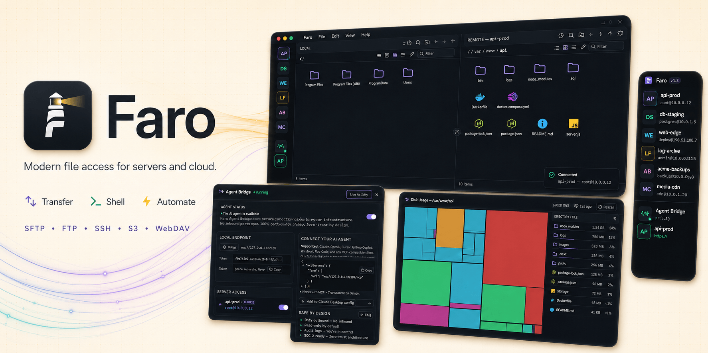

<div align="center">



# Faro

**A modern desktop client for SFTP, FTP, SSH, S3-compatible, WebDAV, and cloud storage.**

Save a server once, then browse its files in a dual-pane view and open a terminal
against the same session — plus an **Agent Bridge** that lets Claude Code (or any
MCP agent) run commands on a box through your authenticated session, with
per-command approval and zero credentials shared.

English | [Español](docs/README.es.md) | [中文版](docs/README.zh-CN.md) | [Português](docs/README.pt.md)

<br>


[](https://discord.gg/ZKk6tkCQfG)
[](https://www.youtube.com/watch?v=nL9r3c9-5Kc)

[](https://github.com/jhd3197/faro/stargazers)
[](https://github.com/jhd3197/faro/releases)
[](LICENSE)
[](https://github.com/jhd3197/faro/releases)
[](https://tauri.app)
[](https://rust-lang.org)
[](https://reactjs.org)

<br>

[Download](#-quick-start) · [Screenshots](#-screenshots) · [Features](#-features) · [Agent Bridge](#-agent-bridge) · [Architecture](#-architecture) · [Roadmap](#-roadmap) · [Docs](#-documentation) · [Contributing](#-contributing) · [Discord](#-community)

</div>

---

## 🚀 Quick Start

> ⏱️ Download, connect, transfer — in under a minute

Grab the latest installer from the [**Releases**](https://github.com/jhd3197/faro/releases/latest) page — every push to `main` publishes fresh builds for all three desktop platforms plus the standalone `faro-cli`.

| Platform | Installer | First-launch note |
|---|---|---|
| **macOS** (Intel + Apple Silicon) | `.dmg` (universal) | One-time `xattr` step ↓ |
| **Windows** (x64) | `.exe` (NSIS) or `.msi` | SmartScreen → *More info → Run anyway* |
| **Linux** (x64) | `.AppImage`, `.deb`, `.rpm` | `chmod +x` the AppImage |

Builds are **unsigned** (no Apple Developer / Windows EV certificate yet), so each OS guards the first launch:

- **macOS** — after dragging **Faro.app** to **/Applications**, run this once in Terminal, then open the app normally:
  ```bash
  xattr -cr /Applications/Faro.app
  ```
  It's needed because the build isn't notarized by Apple; without it macOS reports the app as "damaged."
- **Windows** — on the *"Windows protected your PC"* prompt, click **More info → Run anyway**.

> Prefer to build from source? See [Develop](#develop) below.

<!-- FARO:SHOTS:START -->
## 📸 Screenshots

> Captured from a mock-data build — every hostname, IP, username, and path below is fictional. See [`docs/screenshots/CAPTURE.md`](docs/screenshots/CAPTURE.md) for the shot list and how to reproduce them.

|                          Dual-pane browser                          |                          Disk Usage Explorer                          |
| :-----------------------------------------------------------------: | :-------------------------------------------------------------------: |
|                  |                |
| _Local and remote side by side, drag-and-drop transfers between them_ | _WinDirStat-style treemap over any backend, with a server-side fast path_ |

|                             Server rail                             |                        Integrated terminal                        |
| :-----------------------------------------------------------------: | :---------------------------------------------------------------: |
|                     |                    |
| _Discord-style connection bubbles, with an expandable labeled mode_ | _A real SSH shell tab against the same session you're browsing_ |

|                             Agent Bridge                             |                          Object storage                          |
| :------------------------------------------------------------------: | :--------------------------------------------------------------: |
|                |                |
| _Approve (or auto-approve) each command an AI agent runs on a live session_ | _Browse S3 buckets like a filesystem alongside your SFTP servers_ |

|                             Transfers                             |                          Directory sync                          |
| :---------------------------------------------------------------: | :--------------------------------------------------------------: |
|                    |                        |
| _Queued downloads/uploads with progress and overwrite prompts_ | _Preview a one-way sync plan before anything moves_ |

<details>
<summary><strong>View all screenshots</strong></summary>

<br>

|                          File actions                          |                       Agent Bridge approval                        |
| :------------------------------------------------------------: | :----------------------------------------------------------------: |
|  |  |
| _Duplicate, properties, "download folder as .tar.gz/.zip", "open terminal here"_ | _Every agent command prompts with the exact command before it runs_ |

|                          New connection                          |                             Settings                             |
| :--------------------------------------------------------------: | :--------------------------------------------------------------: |
|            |                    |
| _One profile editor for all fourteen backends, protocol picker in a rail_ | _Themes, terminal behavior, transfers, and the default editor_ |

</details>
<!-- FARO:SHOTS:END -->

## 🎯 Features

> **One connection list, sixteen backends.** Browse, transfer, sync, and the disk-usage / diff / search tools work the same on every one — all behind a single `RemoteFs` trait.

### 📡 Backends & Storage

| | |
|---|---|
| **SFTP / FTP / FTPS**<br>The classics, done right — one SSH session shared between the file browser and the terminal pane. | **S3-compatible**<br>Presets for AWS, Cloudflare R2, Backblaze B2, Wasabi, DigitalOcean Spaces, MinIO, Storj, Hetzner, Scaleway, Oracle OCI, IBM COS, Supabase, and generic self-hosted (Ceph RGW, Garage, SeaweedFS). |
| **Azure Blob & Google Cloud Storage**<br>First-class object storage alongside your servers. | **WebDAV & HTTP(S)**<br>Nextcloud / ownCloud browsing, plus read-only HTTP autoindex and direct-URL sources. |
| **Cloud drives**<br>Dropbox, OneDrive, Google Drive, and Box — loopback + PKCE OAuth, only the refresh token in your OS keychain. | **Faro Agent**<br>Faro's own paired agent as a backend — browse, transfer, and exec on a machine with no SSH server. Delta sync re-sends only the changed blocks of large files. |
| **Shopify themes**<br>Browse and edit store themes like an FTP site — dual-pane, diff, sync, in-place Liquid editing. | **HubSpot CMS**<br>Design Manager files (templates, modules, CSS/JS, HubL) as a filesystem — draft and published environments, edits deploy on save. Plus the File Manager asset library, and HubDB tables as read-only CSV exports. |
| **Dynamics 365 / Dataverse**<br>Web resources (form scripts, CSS, HTML, images) as a filesystem — browse, diff, sync, in-place edit; saves publish automatically. The XrmToolBox workflow, without XrmToolBox. | |

### 🔁 Transfers & Sync

| | |
|---|---|
| **Drag-and-drop transfers**<br>Between panes, recursive directories, multi-select, overwrite/skip/rename policies, multipart upload for objects > 16 MB. | **Directory sync**<br>Preview a one-way plan (Additive or Mirror), then run it — on any two backends. |
| **Continuous folder sync**<br>Attach a local folder to a remote path and it stays mirrored — watcher + poll reconciler, exclude patterns, mirror-delete cap. | **Edit in place**<br>Open a remote file in your local editor; auto-upload on every save, with a live status-bar pill. |

### 🔎 Explore, Diff & Search

| | |
|---|---|
| **Disk Usage Explorer**<br>WinDirStat/WizTree-style treemap + size-ranked tree over any backend, with a shell `du`/`find` fast path. | **Directory Diff**<br>Meld/Beyond-Compare for any two backends — including **remote ↔ remote** (staging vs prod, two buckets). Compare by size or `--hash`. |
| **Fleet Search**<br>Find by name or content — `rg`/`grep` server-side on SSH and Agent servers, flat key listing on buckets. | **CLI parity**<br>All three are in `faro-cli` (`diff`, `search`) and exposed as MCP tools (`faro_diff`, `faro_search`). |

### 🤖 AI & Automation

| | |
|---|---|
| **Agent Bridge**<br>Lend your authenticated session to Claude Code or any MCP agent — localhost only, bearer token, per-command approval. [Details ↓](#-agent-bridge) | **Fleet Skills**<br>AI-authorable, multi-step shell workflows that fan out across servers — AI-authored skills land as proposals needing one human approval. |
| **MCP-native**<br>Auto-discovered tools in Claude Code; a ready-to-paste `SKILL.md` for plain HTTP agents. | **Live audit log**<br>Every command, approval, and denial, right in the Bridge panel. |

### 🖥️ Remote Machines & Sessions

| | |
|---|---|
| **Faro Agent**<br>Control a Windows/macOS/Linux box with no SSH server — 6-digit pairing code, Noise-encrypted, key-pinned. [Details ↓](#-faro-agent--control-another-machine) | **Multi-tab terminals**<br>Real SSH shell tabs sharing one session per profile; tabs survive switches without re-establishing the channel. |
| **Known-hosts verification**<br>Interactive fingerprint prompt; mismatched keys get a danger-toned UI so MITM attempts are obvious. | **ssh-agent everywhere**<br>`$SSH_AUTH_SOCK` on unix, OpenSSH-for-Windows pipe, and Pageant on Windows. |

### 🛠️ Productivity

| | |
|---|---|
| **Profile importers**<br>Bring connections in from `~/.ssh/config`, FileZilla's `sitemanager.xml`, and PuTTY sessions. | **Keyboard-first**<br>Command palette (Ctrl/⌘-K), sortable columns, breadcrumbs, in-pane filter, toasts, custom title bar with menus. |
| **`faro-cli`**<br>Scripts every backend the GUI speaks, using the same saved profiles. [Details ↓](#cli) | **Capability-aware UI**<br>chmod/mkdir hide on backends that don't support them; protocol chips show what you're connected to. |

---

## 🤖 Agent Bridge

**Let a local AI agent run commands on your servers — safely.**

This is the part that makes Faro more than a file client. Connect to a server once, and Faro can lend that **already-authenticated SSH session** to a local AI agent — Claude Code, Cursor, anything that speaks [MCP](https://modelcontextprotocol.io) — so the agent operates on the box **without installing anything remote and without ever seeing your credentials.** Faro stays the gatekeeper.

> **Why it's different:** most "AI over SSH" setups make you hand the agent your keys or stand up a server-side daemon. Faro does neither. The agent borrows the session *you* already opened, *you* approve every command, and nothing reaches the server except the commands you OK.

**Wire it into Claude Code — native MCP, auto-discovered tools:**

1. Connect to a server, open the **Bridge** panel (status-bar pill), hit **Start**, and flip on **Allow agent access**.
2. Copy the one-liner the panel generates and run it in your project:
   ```bash
   claude mcp add --transport http faro http://127.0.0.1:<port>/mcp \
     --header "Authorization: Bearer <token>"
   ```
3. Claude Code now has two tools — `faro_list_sessions` and `faro_exec`. Ask it *"check disk usage on the server"* and it runs through Faro. (Prefer curl or another agent? The panel also exports a ready-to-paste `SKILL.md` for the plain HTTP API.)

**The guardrails — all on by default:**

- 🔒 **Localhost only** — bound to `127.0.0.1` on a random port.
- 🔑 **Bearer token** — per-launch, required on every request.
- ☑️ **Per-session opt-in** — no connection is reachable until you turn it on.
- 🙋 **Approve every command** — each `exec` pops a prompt in Faro and blocks until you click Approve (or it times out).
- 📋 **Live audit log** — every command, approval, and denial, right in the panel.

Surface: `GET /health`, `GET /sessions`, `POST /exec`, and `POST /mcp` (MCP Streamable HTTP). It's a hand-rolled localhost server on the existing tokio runtime — **zero new dependencies.**

## 🖥️ Faro Agent — control another machine

Reach a whole computer — Windows, macOS, or Linux — the way you already drive a
remote server, but **without setting up an SSH server** on it. Pair it once with
a 6-digit code (RustDesk-style) and it appears in Faro as a connection you can
browse, transfer files through, and run native commands on. And because the
[Agent Bridge](#-agent-bridge) brokers Faro's sessions to a local AI, this lets
Claude Code run **PowerShell on your Windows box or `sh` on your Mac, from
anywhere** — through one encrypted, pinned, policy-gated link.

**If both machines already have Faro, there's nothing to download.** On the one
you want to control, open **Settings → Remote control**, toggle it on, and click
**Show pairing code** — then enter that code on your other Faro. Done.

For a **headless server**, one line installs the agent, registers it as a
service, and opens a pairing window:

```bash
curl -fsSL https://github.com/jhd3197/Faro/releases/latest/download/install-agentd.sh | sh
```

Or drive the `faro-agentd` binary yourself — one port now both serves paired
controllers and accepts new pairings, so nothing needs restarting:

```bash
faro-agentd pair          # serve + open a pairing window; prints a 6-digit code
# then in Faro: New Connection → Faro Agent → pick this machine → enter the code.
#               Done — it's pinned; no code next time.

faro-agentd run           # serve paired controllers (no pairing window)
faro-agentd install       # run as a service so it survives reboots
faro-agentd install --read-only   # …serving browse + read + report only
faro-agentd info          # this machine's identity + who's paired
```

**How it's secured** — the link is a [Noise](https://noiseprotocol.org/)
handshake (X25519 + ChaCha20-Poly1305), end-to-end encrypted independent of any
relay. Pairing mixes the code in as a PSK so an active man-in-the-middle can't
complete it; afterward both sides **pin each other's static key** and an
unrecognised peer is refused. The controlled machine keeps its **own** policy
(exec/write/read-only) and audit log, so a paired controller can never do more
than its owner allowed. LAN discovery is mDNS; internet-wide reach (rendezvous +
relay) is a later phase. See [`docs/remote-agent.md`](docs/remote-agent.md).

## Backends

Every backend is one `RemoteFs` implementation, so the dual-pane browser, the
transfer queue, sync, disk-usage explorer, diff, and search all pick it up for
free. Capability differences (no shell on a bucket, read-only on HTTP) hide the
affordances they don't support rather than reinventing them.

| Backend | Browse | Transfer | Sync | Shell |
|---|:-:|:-:|:-:|:-:|
| **SFTP** (SSH) | ✓ | ✓ | ✓ | ✓ |
| **FTP** | ✓ | ✓ | ✓ | — |
| **FTPS** (explicit) | ✓ | ✓ | ✓ | — |
| **S3-compatible** (AWS, R2, B2, Wasabi, …) | ✓ | ✓ | ✓ | — |
| **Azure Blob** | ✓ | ✓ | ✓ | — |
| **Google Cloud Storage** | ✓ | ✓ | ✓ | — |
| **WebDAV** (Nextcloud, ownCloud, …) | ✓ | ✓ | ✓ | — |
| **HTTP(S)** (autoindex / direct URL) | ✓ | download | ← only | — |
| **Dropbox** | ✓ | ✓ | ✓ | — |
| **OneDrive** | ✓ | ✓ | ✓ | — |
| **Google Drive** | ✓ | ✓ | ✓ | — |
| **Box** | ✓ | ✓ | ✓ | — |
| **Faro Agent** | ✓ | ✓ | ✓ | exec |

**Cloud drives** authorize once through your browser (loopback + PKCE OAuth);
Faro stores only the refresh token in your OS keychain and never sees your
password. **HTTP(S)** is a read-only source — point it at an nginx/Apache
autoindex to browse, or a direct URL to pull one artifact; uploads, renames, and
deletes are refused.

---

## 🏗️ Architecture

```
┌──────────────────────────────────────────────────────────────┐
│  React + TypeScript + Tauri webview                          │
│  Dual-pane browser · xterm.js terminal · sync / diff /       │
│  disk-usage / search / skills panels · Agent Bridge          │
└──────────────────────────┬───────────────────────────────────┘
                           │  Tauri commands + events
┌──────────────────────────┴───────────────────────────────────┐
│  Rust core (faro_lib)                                        │
│   RemoteFs → Local·Sftp·Ftp·Object(S3/Azure/GCS)·WebDav·     │
│              Http·Dropbox·OneDrive·GDrive·Box·Agent           │
│   SessionManager pools one session per profile               │
│   TransferManager → concurrent file + directory transfers    │
│   scan.rs (bounded walk + fast paths) → diskscan · diff ·    │
│              search · sync::plan   ·   faro.db (SQLite)       │
│   foldersync.rs → continuous watched sync pairs              │
│   bridge.rs → localhost MCP/HTTP + approvals + Skills        │
│   oauth.rs · importers/ · known_hosts + HostKeyVerifier      │
└───────────────┬───────────────────────────┬──────────────────┘
                │  same Rust core            │  Noise protocol
┌───────────────┴──────────────┐  ┌──────────┴──────────────────┐
│  faro-cli  (clap)            │  │  faro-agentd (controlled     │
│  ls·cp·mv·rm·sync·diff·      │  │  machine): handshake · pin · │
│  search·exec·agent·skill     │  │  policy · native exec + fs   │
└──────────────────────────────┘  └─────────────────────────────┘
```

The wedge: **everything goes through one `RemoteFs` trait.** Adding a new backend means writing one trait impl and one builder; the dual-pane browser, the sync planner, the disk-usage / diff / search tools, the CLI, and the transfer engine all pick it up automatically.

## Develop

```bash
npm install
npm run tauri dev
```

First build is slow — it's compiling the Rust crate tree. Subsequent builds are ~30 s.

**Prerequisites**: Node 20+, Rust 1.88+ (`rustc --version` — Tauri 2's transitive deps require it).

## CLI

A standalone binary, `faro-cli` — its own workspace crate under `src-tauri/faro-cli/` — reuses your saved GUI profiles. Prebuilt binaries ship with every [release](https://github.com/jhd3197/faro/releases/latest), or build it yourself:

```bash
cd src-tauri
cargo build -p faro-cli --release
# → src-tauri/target/release/faro-cli

# File ops — any backend, using your saved profiles
faro-cli profiles list
faro-cli ls prod:/var/log
faro-cli cp ./report.pdf prod:/var/www/uploads
faro-cli sync ./site prod:/var/www/site --mirror --dry-run
faro-cli rm prod:/tmp/build --recursive

# Compare and search — remote↔remote works too
faro-cli diff prod:/etc staging:/etc --hash
faro-cli search prod:/var/log "OutOfMemory" --content --regex
faro-cli exec prod 'systemctl status api'      # SSH profile shell

# Drive the app's Agent Bridge (goes through Faro's approval + console)
faro-cli agent exec prod 'journalctl -u api -n 100'
faro-cli agent exec prod --detach 'apt-get -y upgrade'   # background job id
faro-cli agent write prod /etc/app/patch.conf --from-file ./patch.conf
faro-cli skill run deploy --target all --param branch=main --dry-run

# Fetch an auth-walled page with a saved HTTP(S) profile's creds
faro-cli fetch https://staging.example.com/admin

faro-cli self-update --check   # the CLI ships separately and can lag the app
```

The CLI mirrors the GUI: `ls · cp · mv · rm · mkdir · sync · diff · search ·
exec · profiles`, plus `agent` (drive the running Agent Bridge — `exec`,
`script`, `write`, `read`, background `job`/`jobs`, `search`, `download`,
`upload`), `skill`, `fetch`, and `self-update`. Path syntax: bare paths are
local (including Windows `C:\…`), `name:/path` references a saved profile — so
`diff`/`sync` can span two remotes. It prompts on stdin for unknown host keys
and never writes secrets to disk that the GUI hadn't already saved.

## Layout

```
src/                       React frontend
  components/              DualPaneBrowser, FileBrowser, Terminal,
                           SyncDialog/SyncSettings, DiskUsage/DiskTreemap,
                           DirectoryDiff, FleetSearch, SkillsPanel, AgentBridge,
                           ProfileEditor, ImportDialog, HostKeyModal, …
  stores/                  Zustand stores (bridge, sync, connections, …)
  lib/ipc.ts               Typed wrappers around Tauri commands
  lib/types.ts             Shared types (mirror Rust serde structs)
  mock/                    VITE_MOCK demo data + invoke/listen fakes (screenshots)

src-tauri/src/
  commands.rs              Tauri command surface
  bridge.rs                Agent Bridge — localhost MCP/HTTP server, per-command
                           approval, audit log, Fleet Skills store + runner
  remotefs/                RemoteFs trait + Local/Sftp/Ftp/Object/WebDav/Http/
                           Dropbox/OneDrive/GDrive/Box/Agent impls
  session/                 One session type per backend, SessionManager,
                           HostKeyVerifier trait
  oauth.rs                 Loopback + PKCE OAuth (Dropbox/OneDrive/Drive/Box)
  scan.rs                  Bounded-concurrency RemoteFs walk + strategy select
  db.rs                    faro.db (bundled SQLite) — scan/sync state index
  diskscan.rs / diff.rs / search.rs   scan-engine consumers
  foldersync.rs            Continuous watched sync pairs (watcher + reconciler)
  sync.rs                  Two-tree one-shot sync planner
  transfer.rs              Per-backend streaming transfers + progress
  terminal.rs              PTY over russh, emits events
  agent.rs / agent_host.rs Faro Agent client + in-app "Remote control" host
  cli_updater.rs           faro-cli version-drift check + self-update
  editor.rs · deeplink.rs · importers/ · known_hosts.rs · virtualfs/

src-tauri/faro-cli/        Standalone CLI crate — path-depends on faro_lib
  src/main.rs              clap + indicatif: ls·cp·mv·rm·mkdir·sync·diff·search·
                           exec·agent·skill·fetch·self-update

src-tauri/faro-agent-proto/  Faro Agent wire protocol (Noise channel, msg set,
                             identity/pairing) — Tauri-free, shared by both ends
src-tauri/faro-agentd/       Headless daemon run on a controlled machine:
  src/{server,ops,config,discovery}.rs  handshake·pin·policy·native exec+fs·mDNS
```

## Windows PATH gotcha

If you installed Rust via Chocolatey (`choco install rust`), there's a `rustc.exe` at `C:\ProgramData\chocolatey\bin` that **shadows** the rustup-managed toolchain. `rustup update stable` updates the rustup copy but doesn't touch the chocolatey one, so `rustc --version` keeps reporting the old version and Tauri builds fail with messages like `rustc 1.85.0 is not supported by darling@0.23.0`.

```powershell
# Option A — uninstall the chocolatey copy (recommended)
choco uninstall rust

# Option B — keep both, but make rustup win for this shell
$env:Path = "$env:USERPROFILE\.cargo\bin;$env:Path"
```

---

## 🗺️ Roadmap

- **v1.0** — one-way sync mode
- **v1.1** — `faro-cli` binary
- **v1.2** — edit-in-place external editor
- **v1.3** — custom title bar with File/Edit/View/Help menus + integrated window controls; GitHub Actions release pipeline + CI
- **v1.3** — UI density pass (named themes, command palette, sortable detail columns, breadcrumbs, in-pane filter, toasts); the **🤖 Agent Bridge** (AI-agent command access over native MCP); and **🖥️ Faro Agent** — control a paired Windows/macOS/Linux machine (browse, transfer, native exec) over an encrypted, pinned link, no SSH server required. Now with **in-app Remote control** (host the agent from the Faro app — no separate download), a single always-pairable daemon port, `faro-agentd install` service setup + one-line headless installer, and `faro://` deep links for one-click "Connect with Faro" from a hosting panel
- **recent** — **more backends** (S3 presets for a dozen vendors, Google Cloud Storage, WebDAV, read-only HTTP, the Dropbox / OneDrive / Google Drive / Box OAuth clouds, and **Shopify** / **HubSpot** — browse/edit store themes and CMS Design Manager files like an FTP site); **Disk Usage Explorer**, **Directory Diff** (incl. remote↔remote), and **Fleet Search** over any backend; **Fleet Skills** (AI-authorable fleet automations); **continuous folder sync** with exclude patterns + mirror-delete guard; and a sharper **`faro-cli` / Agent-Bridge remote-exec DX** — background jobs, `agent write`, `agent script`/`--stdin`, authenticated `fetch`, and CLI version-drift self-update
- **next** — SMB/CIFS backend (NAS / Windows shares); on-demand "virtual folder" placeholders (Windows-first, feature-flagged today); bidirectional sync + conflict resolution; brand/protocol logos on the rail and picker; Faro Agent internet reach (rendezvous + NAT hole-punch + relay fallback); transfer speed limits and queue editing (priority/retry/pause)
- **release polish** — code signing (Apple Developer / Windows EV cert), Tauri auto-updater, landing page

---

## 📖 Documentation

| Document | Description |
|----------|-------------|
| [Remote Agent](docs/remote-agent.md) | Faro Agent protocol, pairing, and security model |
| [Deep Links](docs/deep-links.md) | `faro://` one-click "Connect with Faro" links |
| [Screenshot Capture](docs/screenshots/CAPTURE.md) | The shot list and how to reproduce README screenshots |
| [Updater Key Custody](docs/updater-key-custody.md) | Signing-key handling for the Tauri updater |

---

## 🧱 Tech Stack

| Layer | Technology |
|-------|------------|
| App shell | Tauri 2 (Rust) |
| Frontend | React 18, TypeScript, Vite, Zustand, xterm.js, Tailwind CSS |
| Backend core | Rust — one `RemoteFs` trait over 16 backends |
| SSH | russh (SFTP + PTY), ssh-agent / Pageant integration |
| Object storage | S3, Azure Blob, Google Cloud Storage SDKs |
| Cloud drives | Loopback + PKCE OAuth (Dropbox, OneDrive, Google Drive, Box) |
| Agent link | Noise protocol (X25519 + ChaCha20-Poly1305), mDNS discovery |
| AI surface | MCP Streamable HTTP + localhost REST bridge |
| State | Bundled SQLite (`faro.db`) |
| CLI | `faro-cli` (clap) · `faro-agentd` headless daemon |

---

## 🤝 Contributing

Contributions are welcome!

```
fork → feature branch → commit → push → pull request
```

**Priority areas:** new backends (one `RemoteFs` impl and it works everywhere), UI/UX polish, documentation, test coverage.

## Icons

```bash
# Replace src-tauri/icons/source.png with a 1024×1024 PNG, then:
npm run tauri icon src-tauri/icons/source.png
```

`scripts/process-icon.py` handles cropping a black-bordered source PNG to its rounded-square art and writing `source.png` at the right size.

---

## 💛 Support Faro

Faro is free and open source. If it saves you time, you can help keep it going:

- ⭐ [Star the repo](https://github.com/jhd3197/faro) — it costs nothing and helps a lot
- 💖 [GitHub Sponsors](https://github.com/sponsors/jhd3197)
- ☕ [Buy Me a Coffee](https://buymeacoffee.com/jhd3197)

### 💎 Crypto

| | Asset | Network | Address |
|:---:|---|---|---|
|  | **USDT** | **TRC-20** · Tron | `TTiCtqLauF1iSW2YGB3b78KmRxRqoLCgeL` |
|  | **USDT / ETH** | **ERC-20** · Ethereum | `0xD13D5355Fa214e8317fea2ff192a065BaeC13527` |
|  | **BTC** | **Bitcoin** | `bc1qatx67n3qxdvuv3arc9j8aytk34f22g02k9c7vr` |
|  | **SOL** | **Solana** | `AWXzqtBEgUfteHPQtDegsZ6D5y57M3GGdKPD8rR7h6xu` |

TRC-20 has the lowest fees — usually under a dollar — so it's the friendliest
option for a small donation. ERC-20 gas can cost more than the donation itself.

<sub>QR codes are generated locally by [`scripts/generate-funding-qr.mjs`](scripts/generate-funding-qr.mjs), which checksum-validates every address before encoding.</sub>

---

## 🔭 Related Projects

**[ServerKit](https://github.com/jhd3197/ServerKit)** — A lightweight, modern server control panel for managing web apps, databases, Docker containers, and security — without the complexity of Kubernetes or the cost of managed platforms.

> Faro is the desktop companion for hands-on file transfer, shells, and ad-hoc work across all your boxes; ServerKit manages your servers from the browser.

**[LocalKit](https://github.com/jhd3197/LocalKit)** — Spin up local WordPress sites in one click. Each site runs as its own isolated Docker Compose project, and you can push code or push/pull databases straight to your ServerKit server through the `serverkit-localkit` extension.

**[DeviceKit](https://github.com/jhd3197/DeviceKit)** — A unified Android device fleet & test-automation platform. Control a fleet of devices from one dashboard — run automations, stream screens in real time, catch visual regressions, and debug failures with AI-powered analysis.

---

## 💬 Community

[](https://discord.gg/ZKk6tkCQfG)

Join the Discord to ask questions, share feedback, or get help with your setup.

---

## 📄 License

MIT — see [LICENSE](LICENSE).

---

<div align="center">

**Faro** — Servers · storage · sessions, all in one workspace.

[Report Bug](https://github.com/jhd3197/faro/issues) · [Request Feature](https://github.com/jhd3197/faro/issues)

Made with ❤️ by [Juan Denis](https://juandenis.com)

</div>
